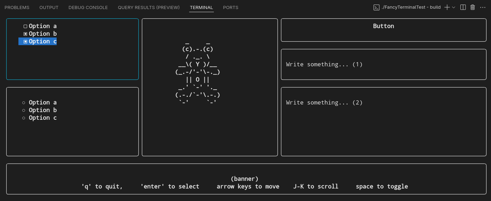

# FancyTerminal
There are a lot of TUI library, how many of them are based on pure C?

Presenting... 
FancyTerminal, 
a completely C based cross-platform Terminal UI library.

<br>


# Usage

- First initialize a fancy terminal container
    
    ```c    
    FancyTerminal *ft=initFancyTerminal();
    ```
- Configure the layout (see [User Guide](./docs/UserGuide.md) for more details)
    
    ```c
    setFTLayoutPattern(
    ft,
    2,5,
    "1 1 0 2 2\n"
    "1 1 0 2 2\n"
    );
    ```
- create elements and add them to the ft container

    ```c
    FTElement *button=createFTButton("Button");                            
    addToFancyTerminal(ft,button);

    FTElement *textField=createFTTextField("Text Hint","");    
    addToFancyTerminal(ft,text_field);
    ```
- connect callback / event handler functions (if you have any)
    
    ```c
    ft_connect(move_btn, FT_EVENT_CLICK, myFunction, NULL);
    ```
- finally, start the main loop of the fancy terminal

    ```c
    enterFancyTerminal(ft);
    ```
<br>


# Demo 



Demo Installation

```bash
git clone https://github.com/alfaiajanon/FancyTerminal.git
cd TUI-FancyTerminal
cd build
cmake .
make
```
<br>


# Developer Guide

Please see the [Developer Guide](./docs/DeveloperGuide.md)